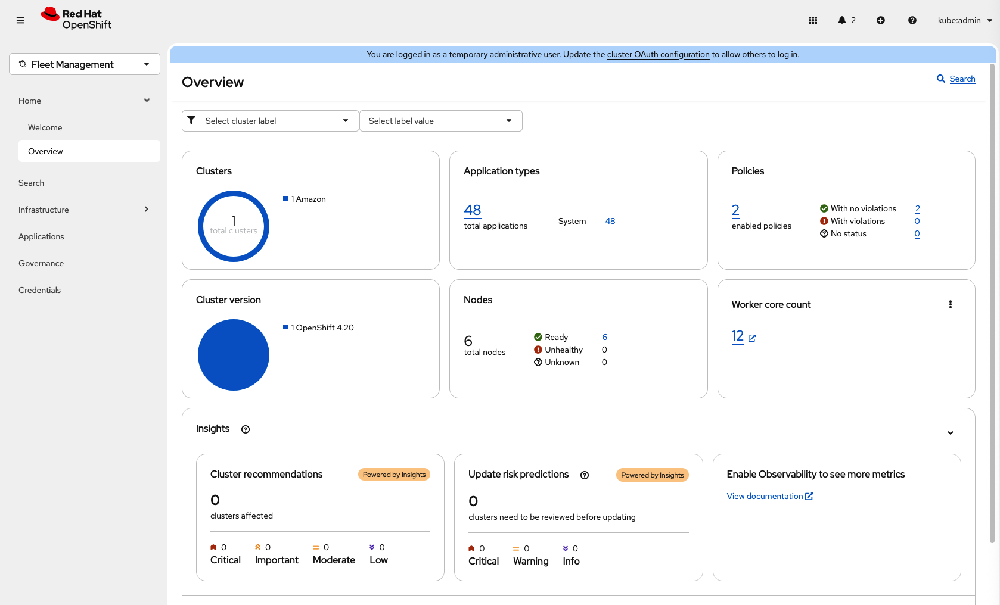
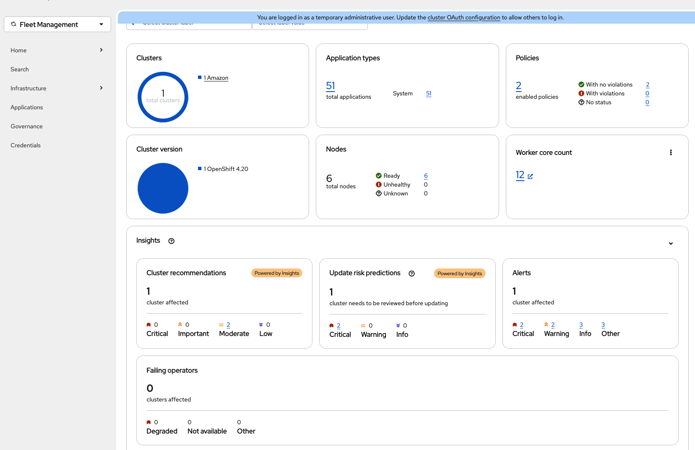

# Insights On Premise (monolithic version)

A Python application that receives Insights archives, processes them with insights-core, and stores results in PostgreSQL. Designed for on-premise deployment in ACM clusters.

## API Endpoints

### Upload Archive
```
POST /api/ingress/v1/upload
```
Upload an Insights archive for processing.

**Example:**
```bash
curl -X POST http://localhost:8000/api/ingress/v1/upload -F "file=@/path/to/archive.tar.gz"
```

### Get Cluster Report
```
GET /api/v2/cluster/{cluster_id}/reports
```
Retrieve processed report for a cluster.

### Batch Upgrade Risk Predictions
```
POST /api/insights-results-aggregator/v2/upgrade-risks-prediction
```
Returns upgrade risk predictions for a list of clusters by querying Thanos for active alerts and failing operator conditions. Matches the `ccx-upgrades-data-eng` API format so the ACM console can route URP calls to this service instead of `console.redhat.com`.

### Get Request Processing Status (on-demand data gathering)
```
GET /api/v2/cluster/{cluster_id}/request/{request_id}/status
```
Check whether an on-demand data gathering request has been processed. Returns 404 while processing is in progress (the operator retries), 200 once ready.

### Get Request Report (on-demand data gathering)
```
GET /api/v2/cluster/{cluster_id}/request/{request_id}/report
```
Retrieve the simplified report for a specific on-demand data gathering request ID.

### Health Check
```
GET /health
```

### API Documentation
- Swagger UI: http://localhost:8000/docs
- ReDoc: http://localhost:8000/redoc

## Building and Pushing Multiarch Image

Build and push a multiarch (amd64, arm64) image to Quay (this step is necessary because cluster nodes may run on different architecture than the development environment):

```bash
# Login to Quay
docker login quay.io

# Build and push multiarch image
docker buildx build --platform linux/amd64,linux/arm64 \
  -t quay.io/ccxdev/insights-on-premise-poc:latest \
  --push .
```

## Running Locally with Docker Compose

1. **Start services:**
   ```bash
   docker-compose up -d
   ```

2. **Run database migrations:**
   ```bash
   docker-compose exec app alembic upgrade head
   ```

3. **Verify:**
   ```bash
   curl http://localhost:8000/health
   ```

4. **View logs:**
   ```bash
   docker-compose logs -f app
   ```

5. **Stop services:**
   ```bash
   docker-compose down
   ```

## Deploying to ACM Cluster

### Prerequisites
- OpenShift cluster with ACM installed
- MultiClusterHub created in `open-cluster-management` namespace (it can take several minutes before all components are started)
- Quay pull secret for `ccxdev/insights-on-premise-poc` repository saved as `deploy/ccxdev-insights-on-prem-poc-secret.yml`
- (optional) Have Multicluster Observability Operator deployed according to [these instructions](https://github.com/stolostron/multicluster-observability-operator/tree/main?tab=readme-ov-file#run-the-operator-in-the-cluster) - required for upgrade risk predictions
- (optional) TechPreview enabled on the hub cluster — required for on-demand data gathering on clustering running Openshift versions <= 1.21. **Warning:** this is irreversible.
  ```bash
  oc patch featuregate cluster --type merge -p '{"spec":{"featureSet":"TechPreviewNoUpgrade"}}'
  oc wait co machine-config --for='condition=Progressing=False' --timeout=30m
  ```

### Deploy

```bash
./deploy.sh
```

This script:
1. Creates `insights-on-prem-poc` namespace
2. Deploys PostgreSQL database
3. Deploys the application and service
4. Configures `insights-operator` to upload archives to the on-premise service
5. Pauses MultiClusterHub operator and configures `insights-client` to use the on-premise backend

#### Secrets

The postgres password is stored in the secret `insights-postgres` in the `insights-on-prem-poc` namespace, defined in `deploy/postgres.yml`. Note that this is not the best practice, so please use the preferred method on your cluster to define the secret. We kept it there to make it easier to deploy the application with a single script and no human intervention.

### Verify Deployment

```bash
# Check pod status
oc get pods -n insights-on-prem-poc

# Check service
oc get svc -n insights-on-prem-poc

# Verify insights-client configuration
oc get deployment insights-client -n open-cluster-management -o yaml | grep -A2 'name: CCX_SERVER'

# Check logs
oc logs -f deployment/insights-on-prem -n insights-on-prem-poc
```

### Important Notes

- **MultiClusterHub operator is paused** after deployment (annotation `mch-pause=true`) to prevent it from reverting the `CCX_SERVER` configuration.
- To unpause the operator:
  ```bash
  oc annotate multiclusterhub multiclusterhub -n open-cluster-management mch-pause- --overwrite
  ```

## On-Demand Data Gathering

On-demand data gathering allows triggering Insights data collection outside the regular periodic schedule. Instead of waiting for the next periodic upload (default 2h, set to 1m by `deploy.sh`), you can request an immediate gather-and-upload cycle and get results for that specific request.

> **Note:** Conditional data gathering is not supported at this moment. Disable the `conditional` gatherer in the `DataGather` CR to avoid unnecessary calls to `console.redhat.com` for gathering rules (as shown in the following section).

### How to Trigger

Create a `DataGather` custom resource:

```bash
oc apply -f - <<'EOF'
apiVersion: insights.openshift.io/v1alpha2
kind: DataGather
metadata:
  name: on-demand-test
spec:
  gatherers:
    mode: Custom
    custom:
      configs:
      - name: conditional
        state: Disabled
  storage:
    type: Ephemeral
EOF
```

The insights-operator detects the new CR, creates a Job in `openshift-insights`, and the Job:
1. Runs all gatherers and writes an archive
2. Uploads the archive to the on-prem service
3. Polls the processing status endpoint until the archive is processed
4. Logs success — the operator then fetches the report for the specific request ID

### Monitoring

Watch the Job and its logs:

```bash
# Check job status
oc get jobs -n openshift-insights | grep -v periodic

# Follow the job pod logs
oc logs -n openshift-insights -l job-name=on-demand-test -f

# Check the DataGather CR status
oc get datagather on-demand-test -o yaml
```

The `DataGather` CR status conditions show the lifecycle:
- `DataRecorded` — archive written to disk
- `DataUploaded` — archive uploaded to the on-prem service
- `DataProcessed` — archive processed and results available

### Cleanup

Jobs and `DataGather` CRs older than 24 hours are automatically pruned by the operator. To delete manually:

```bash
oc delete datagather on-demand-test
oc delete job on-demand-test -n openshift-insights
```

## How to trigger an Insights recommendation

To trigger creation of an Insights recommendation, and the creation of the corresponing `PolicyReport` custom resource by an Insights Client,
at least one of the rule conditions has to be met. The easiest way to achieve that is by running the following command:

```bash
oc apply -f - <<'EOF'
apiVersion: admissionregistration.k8s.io/v1
kind: ValidatingWebhookConfiguration
metadata:
  name: insights-test-webhook
webhooks:
  - name: insights-test.example.com
    admissionReviewVersions: ["v1"]
    clientConfig:
      url: "https://localhost:1234/validate"
    failurePolicy: Ignore
    sideEffects: None
    timeoutSeconds: 30
    rules:
      - apiGroups: [""]
        apiVersions: ["v1"]
        operations: ["CREATE"]
        resources: ["pods"]
        scope: "*"
EOF
```

The command should trigger [webhook_timeout_is_larger_than_default](https://gitlab.cee.redhat.com/ccx/ccx-rules-ocp/-/blob/master/ccx_rules_ocp/external/rules/webhook_timeout_is_larger_than_default.py) rule. Depending on the frequency of archive uploads from Insights Operator (in `deploy.sh` script set to 1 minute for PoC purposes, but default value is 2 hours), the recommendation and the `PolicyReport` should be created. You can check that with this command directly in the ACM cluster:

```bash
oc get policyreport --all-namespaces
```

## Viewing Results in the ACM Fleet Overview UI

The results of the on-premise pipeline are visible in the ACM fleet overview at:

```text
https://<your-cluster-api-server>/multicloud/home/overview
```

**Before** (`deploy.sh` only, without `test_ui.sh`):



**After** (`test_ui.sh` applied):



The Insights section of that page has four panels. Here is what backs each one and what is needed for it to show data:

### Cluster recommendations

**Source:** `PolicyReport` custom resources created by `insights-client` in each managed cluster's namespace.

**Extra setup:** N/A, triggered recommendations are shown in UI

### Update risk predictions

**Source:** The ACM console backend forwards URP calls to `console.redhat.com`. The URL is now configurable via the `UPGRADE_RISKS_PREDICTION_URL` env var ([CCXDEV-16237](https://redhat.atlassian.net/browse/CCXDEV-16237), [merged](https://github.com/stolostron/console/pull/5892)). `test_ui.sh` sets this env var to point to the on-prem service. See the [Custom console image for URP](#custom-console-image-for-urp) section below.

### Alerts

**Source:** Thanos directly, via MCO. The ACM console reads `ALERTS` metrics from Thanos and displays raw alert counts. No on-prem involvement — this section works automatically once MCO is deployed.

**How PrometheusRule → Thanos works:** `PrometheusRule` is a Kubernetes CRD provided by the Prometheus Operator (part of OpenShift monitoring). When applied, Prometheus evaluates the alerting rules and fires alerts matching the conditions. MCO's `metrics-collector` pod remote-writes all metrics — including the `ALERTS` series — from the cluster's Prometheus to the central Thanos instance. Once in Thanos, they are queryable via `rbac-query-proxy` by the on-prem service and visible in the ACM console's Alerts panel.

### Failing operators

**Source:** Thanos directly, via MCO. The ACM console reads `cluster_operator_conditions` metrics from Thanos. No on-prem involvement.

### Testing the on-prem pipeline panels

Run `test_ui.sh` after `deploy.sh` to set up test data that triggers all four sections and verifies the data is flowing through the on-prem service (not `console.redhat.com`):

```bash
./test_ui.sh
```

#### Custom console image for URP

`test_ui.sh` deploys a custom console image (`quay.io/ccxdev/insights-on-prem-lsolarov-console:latest`) built from `stolostron/console` main, which already includes `UPGRADE_RISKS_PREDICTION_URL` env var support ([CCXDEV-16237](https://redhat.atlassian.net/browse/CCXDEV-16237)). It is needed only until a new ACM release ships with this change.

> **Note:** The image is private. `deploy.sh` automatically copies the existing `ccxdev-insights-on-prem-poc-pull-secret` (created in step 3) to `open-cluster-management` — no extra setup needed since it uses the same `ccxdev+insights_on_prem_poc` robot account.
> **Note:** [CCXDEV-16237](https://redhat.atlassian.net/browse/CCXDEV-16237) is merged — the custom image is for testing only until a new ACM release ships with this change.

```typescript
// Before (hardcoded):
const insightsPath = 'https://console.redhat.com/api/insights-results-aggregator/v2/upgrade-risks-prediction'

// After (env var with fallback):
const insightsPath = process.env.UPGRADE_RISKS_PREDICTION_URL ?? 'https://console.redhat.com/api/insights-results-aggregator/v2/upgrade-risks-prediction'
```

Once a new ACM release ships with this change, the custom image is no longer needed — `test_ui.sh` reduces to just setting `UPGRADE_RISKS_PREDICTION_URL` to the HTTPS route of the on-prem service.

To rebuild the custom image (no code changes needed — the change is already in `stolostron/console` main):
```bash
git clone git@github.com:stolostron/console.git
cd backend && npm install && npm run build
docker buildx build --platform linux/amd64,linux/arm64 \
  -t quay.io/ccxdev/insights-on-prem-lsolarov-console:latest \
  --push .
```

## Database Access

The application deploys its own PostgreSQL database.

**Connect to database:**
```bash
# Locally
docker-compose exec postgres psql -U insights -d insights

# In cluster
oc exec -it deployment/insights-postgres -n insights-on-prem-poc -- psql -U insights -d insights
```
